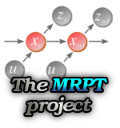
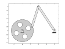
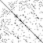
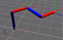
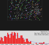
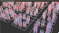

Title: Software
Date: 2016-12-12 01:00
Modified:2016-12-12 01:00
myorder: 4

<table border="0" cellpadding="5">
<tr>
  <td align="center"> <a href="https://github.com/jlblancoc" target="_blank">  GitHub </a></td>
  <td align="center"><a href="https://code.google.com/u/joseluisblancoc@gmail.com/" target="_blank">  Google Code </a></td>
  <td align="center"><a href="https://qa.debian.org/developer.php?login=joseluisblancoc%40gmail.com" target="_blank">  Debian/Ubuntu packages </a></td>
</tr>
</table>

 

<h2>Robotics</h2>

<b>

<b> 
</b>

<ul><li><a href="http://www.mrpt.org/" target="_blank">Mobile Robot Programming Toolkit</a> (MRPT, 2005-present)</b> provides C++ developers an extensive, portable and well-tested set of libraries and applications which cover the most common data structures and algorithms employed in a number of mobile robotics research areas: <b>localization</b>, <b>Simultaneous Localization and Mapping</b> (SLAM), <b>computer vision</b> and <b>motion planning</b> (obstacle avoidance). </li></ul>

 

 
<ul><li><b>ROS packages:</b> <ul>
  <li><a href="http://wiki.ros.org/mrpt_navigation"><code>mrpt_navigation</code></a></li>
  <li><a href="https://github.com/ual-arm-ros-pkg"><code>ual-arm-ros-pkg</code></a></li>
 </ul>
</li></ul>

 
<ul><li><b><b>The&nbsp;<a href="https://github.com/OpenMORA" target="_blank">OpenMORA</a> framework (2008-2014):</b>&nbsp;Based on <a href="http://www.robots.ox.ac.uk/~mobile/MOOS/wiki/pmwiki.php/Main/Introduction" target="_blank">MOOS</a> and MRPT.</b></li></ul>

 

<h2>Other Open-Source projects</h2>

 

<ul><li><b><a href="https://github.com/jlblancoc/mechplot" target="_blank">Mechplot</a> </b><b>(2013):</b>&nbsp;MATLAB library (toolkit) to render structures and mechanisms.. 
 
</li></ul>

<ul><li><b><a href="https://github.com/jlblancoc/suitesparse-metis-for-windows" target="_blank">CMake build system for StuiteSparse+METIS</a> </b><b>(2013-14):</b>&nbsp;Allows using these libraries from Visual Studio or any other compiler supported by CMake. 
 
</li></ul>

<ul><li><b><a href="http://www.mrpt.org/list-of-mrpt-apps/application-robotic-arm-kinematics/" target="_blank">Denavit-Hartenberg GUI tutorial</a> </b><b>(2013):</b>&nbsp;A didactic tool for learning, teaching or designing robotic arm kinematics. 
 
</li></ul>

 

<ul><li><b><a href="http://code.google.com/p/maxwell-boltzmann-simulator/" target="_blank">Maxwell-Boltzmann simulator</a></b><b>&nbsp;(2012):</b>&nbsp;A graphical simulator, with didactic purposes, which illustrates the Physics behind the kinetic theory of gasses and its relationship to probability distributions. Part of a Spanish Science blog article.</li></ul>

<ul><li><b><a href="http://code.google.com/p/recursive-world-toolkit/" target="_blank">The Recursive World Language (RWL) toolkit</a>&nbsp;(2011-2013):</b>&nbsp;A language definition and an interpreter for creating vast simulated worlds within which to simulate SLAM datasets.</li></ul>
<ul><li><b><a href="http://code.google.com/p/mooxygen/" target="_blank">mooxygen</a> (2009-2010):&nbsp;</b>A tool which scans a directory tree containing MOOS modules and generates documentation about the variables that each module publishes or subscribes to, pretty much like <i>doxygen</i> does with functions and classes.</li></ul>
<ul><li><b><a href="http://eigen.tuxfamily.org/" target="_blank">Eigen</a> linear Algebra C++ library:</b> Really, really recommendable library. I made insignificant contributions there but don't want to waste the opportunity to recommend it.</li></ul>
<ul><li><b><a href="http://code.google.com/p/utf-bom-utils/" target="_blank">UTF-bom-utils</a> (2009):</b>&nbsp;Two small tools for adding and removing the UTF8 BOM marks to text files.</li></ul>
<ul>
 <li><b>Particle filter resampling routines in MATLAB (2009):</b>
This package has been published in the
<a href="http://www.mathworks.es/matlabcentral/fileexchange/24968">MATLAB Central</a> web.</li>

</ul>

<ul>
 <li><b>The wxMathPlot library:</b> This is a set of classes to allow the easy representation of scientific 2D graphs in GUI applications developed with the cross-platform <a href="http://www.wxwidgets.org/" target="_blank">wxWidgets</a> framework. I made small contributions to this project. Visit the wxMathPlot <a href="http://wxmathplot.sourceforge.net/" target="_blank">main webpage</a> at sourceforge.
 </li>

</ul>

<ul>
 <li><b>OpenCV</b>: I made some small contributions to this C/C++ library well known in the field of computer vision.
  Visit the project <a href="http://opencvlibrary.sourceforge.net/" target="_blank">website</a> for more information and downloads.
 </li>

</ul>

<ul>
 <li><b>syncpath (2007):</b> A cross-platform, open-source, lightweight command-line tool for synchronizing a source and a target directory. It can be used to synchronize two local directories in a machine, for example, a working directory and a backup in a removable device.
 Visit the <a href="http://syncpath.sourceforge.net/" target="_blank">sourceforge website</a> to download the code or compiled versions.
 </li>

</ul>

<ul>
 <li> <b>"Open-cv bots" (2009):</b> Fancy computer vision-based programs that learn how to play to Facebook games autonomously. Web: <a href="http://open-cv-bots.blogspot.com/" target="_blank">http://open-cv-bots.blogspot.com/</a>
 </li>

</ul>
